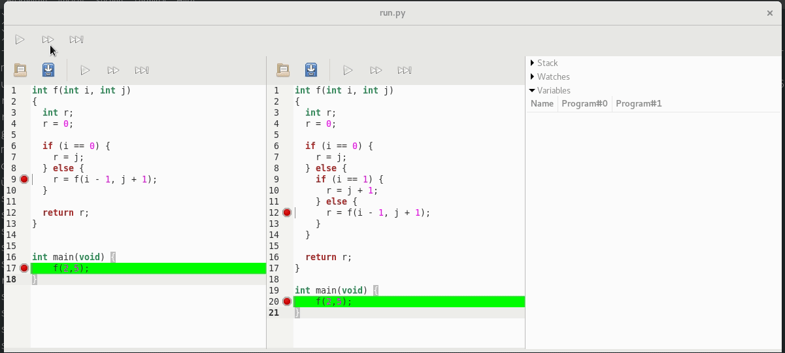

# bigdb

GDB for Relational Debugging

* Author: `Alexander Weigl <weigl@kit.edu>`
* Version: `0.1`

This is a prototype for a relational debugger, that bases on `gdb`.
In relational debugging, you debug two or more program runs against each other.

# Demo

# Features

* [ ] check support for different languages
* [ ] watch expression
  * [ ] simpel
  * [ ] relational (evaluation in python?)
* [ ] synchronisation points
* [ ] stack/frames
* [ ] heap visualization
